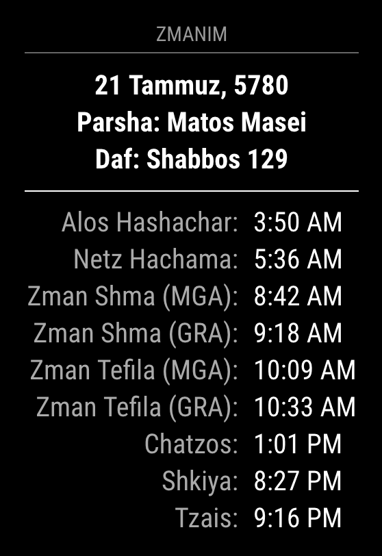
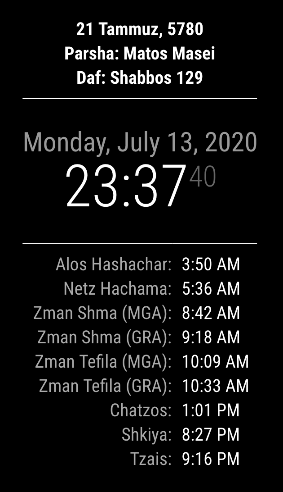

# MMM-Zmanim (MagicMirrorModule)
Display Daily Jewish times and events from the [KosherZmanim API](https://github.com/KosherJava/zmanim) in your [MagicMirror](https://github.com/MichMich/MagicMirror).




Second image based on [this configuration](https://github.com/jseidman95/MMM-Zmanim/blob/master/ClockWrappingExampleConfiguration.md)

## Installation
1. Go to `MagicMirror/modules`
2. Execute `git clone https://github.com/jseidman95/MMM-Zmanim.git`

## Using the module
To use this module, add it to the modules array in the `config/config.js` file:
```
modules: [
    ...
    {
        module: "MMM-Zmanim",
        position: "top_left", // This can be any region
        config: {
            // See 'Configuration options' for more information.
        }
    },
    ...
]
```

## Configuration options
The following properties can be configured:

| Option                  | Default            | Description
| -----------------       | ------------------ | ----------- 
| `timeZoneId`            | `America/New_York` | Time Zone Id based on https://docs.oracle.com/middleware/12212/wcs/tag-ref/MISC/TimeZones.html
| `locationName`          | `Teaneck`          | The name of the city/state/town etc. to show the zmanim for
| `latitude`              | `40.884819`        | Latitude of the location to show the zmanim for
| `longitude`             | `-74.006561`       | Longitude of the location to show the zmanim for
| `elevation`             | `0`                | Elevation of the location to show the zmanim for
| `displayedFields`       | [see displayedFields section](https://github.com/jseidman95/Zmanim#displayedfields-summary) | The displayed zmanim fields
| `displaysPastZmanim`    | `true`             | Boolean that controls whether zmanim times that have passed are displayed
| `graysOutPastZmanim`    | `false`            | Boolean that controls whether zmanim that have passed are displayed with a grayed out UI
| `inIsrael`              | `false`            | Boolean that adjusts the zmanim for Israel or not
| `showsHebrewDate`       | `true`             | Boolean that controls if the hebrew date is shown at the top
| `showsParsha`           | `true`             | Boolean that controls if this upcoming weeks parsha is shown at the top
| `showsDaf`              | `true`             | Boolean that controls if today's daf is shown at the top
| `showsDayOfOmer`        | `true`             | Boolean that controls if today's omer count (if applicable) is shown at the top
| `showsSpecialShabbos`   | `true`             | Boolean that controls if the upcoming special shabbos (if applicable) is shown at the top
| `showsYomTov`           | `true`             | Boolean that controls if today's yom tov (if applicable) is shown at the top
| `alwaysShowDividerLine` | `false`            | Boolean that controls if the divider line is always shown (even if no top content is shown)
| `showTomorrowsZmanim`   | `false`            | Boolean that controls if zmanim for the next 24 hours are shown
| `showAllTomorrowsZmanim`| `false`            | Boolean that controls if zmanim for the next next day

## displayedFields
displayedFields is a property in the config that controls the zmanim displayed and their names.  Its type is a JSON object with the 
following structure:
```
    {
        <ZmanAPIName>: <DisplayedZmanName>,
        <ZmanAPIName>: <DisplayedZmanName>
        ...
    }
```
Where `<ZmanAPIName>` is the `KosherZmanim` field name where the possible options are [here](https://github.com/jseidman95/Zmanim/blob/master/ComplexZmanimFields.txt);
and `<DisplayedZmanName>` is the name that will be displayed and can be whatever you choose

## Credits
- MagicMirror: https://github.com/MichMich/MagicMirr
- KosherZmanim: https://github.com/BehindTheMath/KosherZmanim